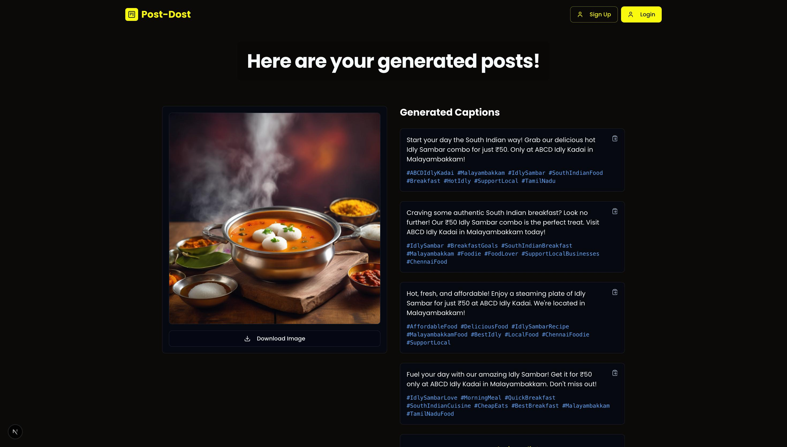
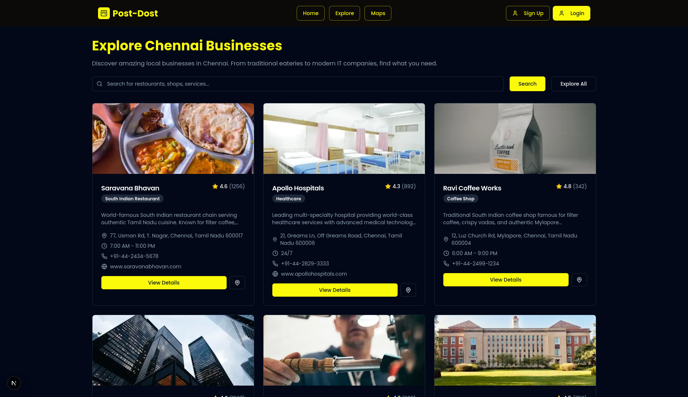
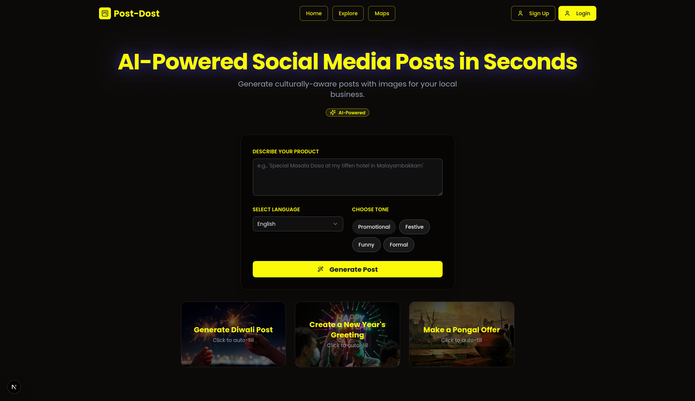
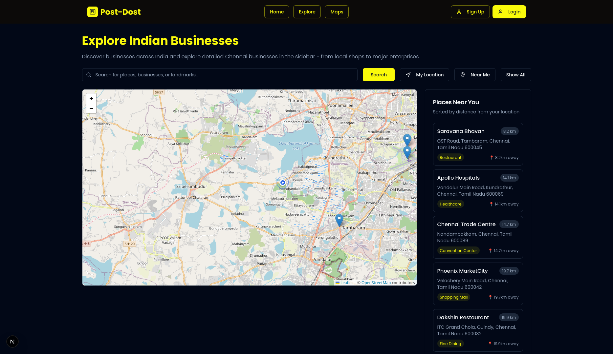

<div align="center">
   
   
    
   
   <h1>PostDost AI</h1>
   <p><em>🚀 Culturally-aware social media content generator for local Indian businesses</em></p>

   <!-- Badges -->
   <p>
      <a href="https://nextjs.org"></a>
      <a href="https://www.typescriptlang.org/"></a>
      <a href="https://tailwindcss.com"></a>
      <a href="https://ui.shadcn.com"></a>
      <a href="LICENSE"></a>
   </p>
</div>

---

## 📌 Overview

PostDost AI helps small & local Indian businesses quickly spin up engaging, culturally-relevant social media post ideas (captions + placeholder images). The current version ships with deterministic placeholder generation (no external AI calls) to keep the project light, demo-friendly, and privacy-safe. You can later plug in any AI provider (OpenAI, Gemini, Claude, etc.).

> NOTE: All former Genkit / Gemini integrations were intentionally removed and replaced with pure TypeScript placeholder flows. Feel free to fork and reintroduce a model layer.

## 🧭 Table of Contents
1. Features
2. Tech Stack
3. Architecture Snapshot
4. Screenshots
5. Quick Start
6. Configuration
7. Project Structure
8. Scripts
9. Development Notes
10. Roadmap
11. Contributing
12. License
13. Support

## ✨ Features

| Category | Highlights |
|----------|------------|
| Post Ideas | Multi-caption generation with localized hashtag patterns |
| Image Placeholder | Deterministic pseudo-random selection from curated sources (no API keys) |
| Maps (Optional) | Leaflet + OpenStreetMap exploration with geolocation & mock POIs |
| UI/UX | Dark theme, accessible components (shadcn/ui + Radix primitives) |
| Forms | React Hook Form + Zod validation with strong typing |
| Auth | Basic JWT-based auth endpoints (can be hardened further) |
| Extensibility | Simple flow functions you can swap for real AI providers |
| Tooling | Type-safe, lintable, modular setup |

## 🛠 Tech Stack

| Layer | Tools |
|-------|-------|
| Framework | Next.js 15 (App Router) |
| Language | TypeScript (strict) |
| Styling | Tailwind CSS + shadcn/ui + CSS Modules (globals) |
| Forms & Validation | React Hook Form + Zod |
| Icons | Lucide React |
| Maps | Leaflet + React-Leaflet (scoped import) |
| Auth | Custom JWT (stateless) |
| Utilities | Lightweight placeholder generation utilities |

## 🧱 Architecture Snapshot

Core concept: "Flows" generate post data (captions + image reference). UI consumes them via server components + client hydration. Auth is minimal (can be swapped for NextAuth or Clerk). Maps are lazy-loaded to avoid SSR pitfalls.

High-level flow:
```
User Input -> Zod Validation -> Placeholder Flow -> Result Page Renderer -> Copy / Download Actions
```

## � Screenshots

| Generated Posts Page |
|----------------------|
|  |

> Add more screenshots in a `screenshots/` folder if desired (e.g., login, maps, explore pages).

## 🚀 Quick Start

### Automated Setup (Recommended)

**Windows:**
```bash
.\setup.bat
```

**Linux/macOS:**
```bash
chmod +x setup.sh
./setup.sh
```

### Manual Setup

1. **Clone the repository:**
```bash
git clone https://github.com/sanjayrohith/post-dost.git
cd post-dost
```

2. **Install dependencies:**
```bash
npm install --legacy-peer-deps
```

3. **Set up environment variables:**
```bash
cp .env.example .env.local
```

Edit `.env.local` with your configuration:
```env
JWT_SECRET=your-super-secret-jwt-key-change-in-production
NEXT_PUBLIC_APP_URL=http://localhost:3000
NODE_ENV=development
```

4. **Start development server:**
```bash
npm run dev
```

5. **Open the application:**
   - Navigate to `http://localhost:3000`
   - You should see the app with Home | Explore | Maps navigation

## ⚙️ Configuration

Create `.env.local` (copy from `.env.example`):
```ini
JWT_SECRET=change-me-in-production
NEXT_PUBLIC_APP_URL=http://localhost:3000
NODE_ENV=development
```

Optional (if you reintroduce AI later):
```ini
OPENAI_API_KEY=...
GEMINI_API_KEY=...
```

## 🔧 Troubleshooting

### "Nothing shows up" / Blank page
```bash
# Clear cache and reinstall
rm -rf node_modules package-lock.json
npm install --legacy-peer-deps
npm run dev
```

### Maps not loading
1. Check browser console for errors
2. Ensure you're using a modern browser
3. Try refreshing the page

### React/Leaflet version conflicts
```bash
npm install --legacy-peer-deps
```

## 📱 Feature Detail

### Post Generator
Deterministic caption + image selection (no rate limits). Replace the flow in `src/ai/flows/generate-social-media-post.ts` to integrate a real model.

### Maps Module (Optional)
If you don't need maps, delete `src/app/maps` + related deps (`leaflet`, `react-leaflet`, `@types/leaflet`). CSS is locally imported in the page to reduce global weight.

### Auth
Simple JWT issuance via API routes. Improve by:
- Rotating secrets
- Using HttpOnly secure cookies
- Adding route middleware for protected pages

### Placeholder Images
Currently uses whitelisted remote sources from Next config. Swap with an internal CDN or AI image generator later.

## 🗂 Project Structure

```
src/
├── ai/                 # AI-related functionality
│   ├── genkit.ts      # Genkit configuration
│   └── flows/         # AI workflows
├── app/               # Next.js app router pages
├── components/        # React components
│   └── ui/           # shadcn/ui components
├── hooks/            # Custom React hooks
└── lib/              # Utility functions
```

## 📜 Scripts

- `npm run dev` - Start development server
- `npm run build` - Build for production
- `npm run start` - Start production server
- `npm run lint` - Run ESLint
- `npm run type-check` - Run TypeScript compiler

## 🤝 Contributing

1. Fork the repository
2. Create your feature branch (`git checkout -b feature/amazing-feature`)
3. Commit your changes (`git commit -m 'Add some amazing feature'`)
4. Push to the branch (`git push origin feature/amazing-feature`)
5. Open a Pull Request

## 📄 License

This project is licensed under the ISC License.

## 💬 Support

Have a question or idea? Open an issue or start a discussion.

---

## 🛣 Roadmap (Planned / Ideas)

- [ ] Secure HttpOnly cookie-based auth session
- [ ] Real AI provider integration behind feature flag
- [ ] Image generation microservice
- [ ] i18n (multi-language captions)
- [ ] Map POI real data via external API
- [ ] Accessibility audit pass (axe score)
- [ ] Automated e2e tests (Playwright)

---

## 🧪 Development Notes

- Leaflet CSS is intentionally NOT globally imported—only in the maps page.
- All AI code is stubbed; swapping providers should only require updating flow functions.
- Prefer adding new flows under `src/ai/flows/` with a consistent return shape.

---

Made with ❤️ for local Indian entrepreneurs.

For support, please open an issue in the [GitHub repository](https://github.com/sanjayrohith/post-dost/issues).
